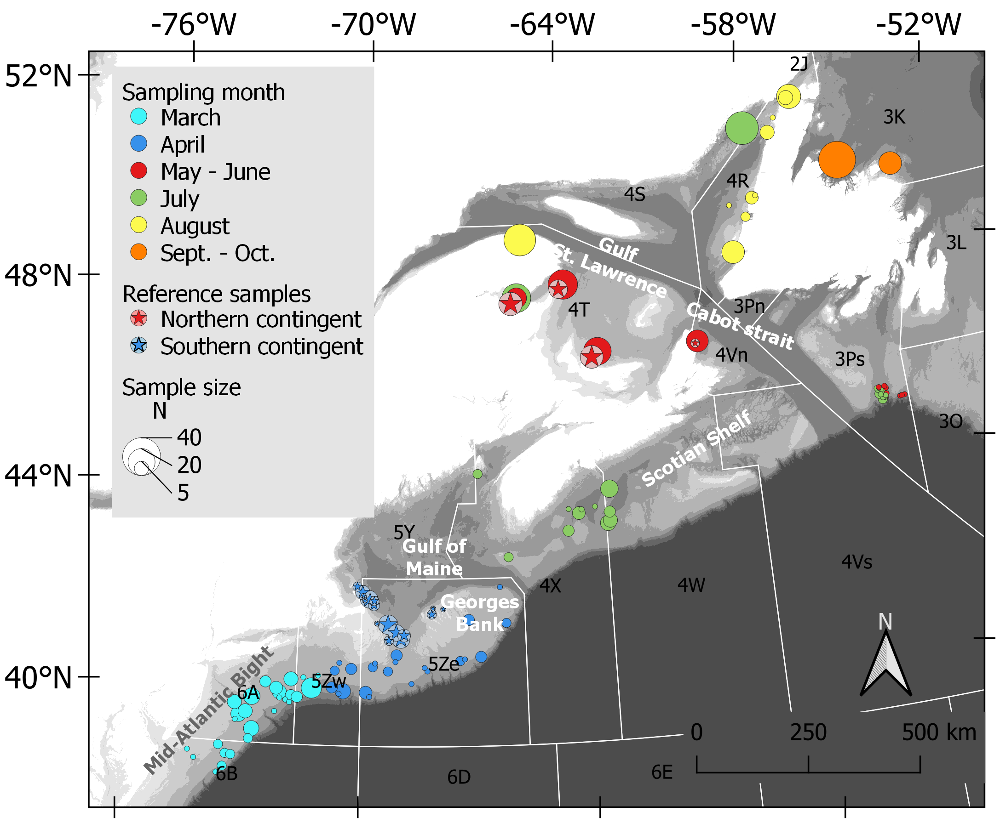
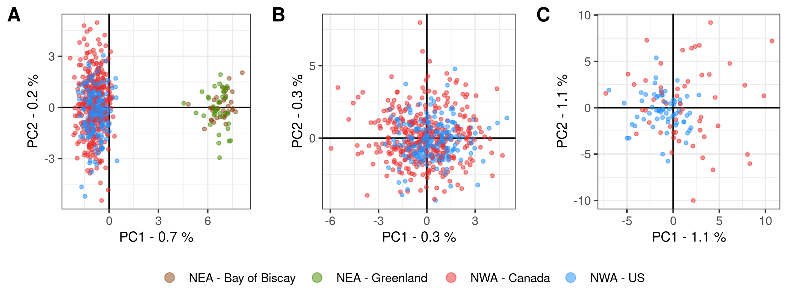
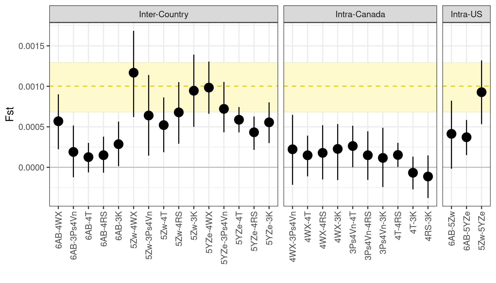
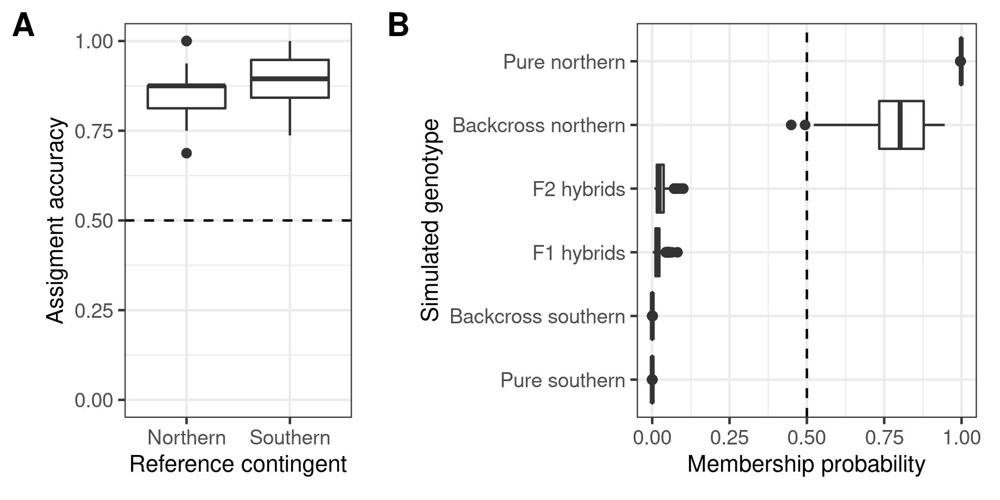
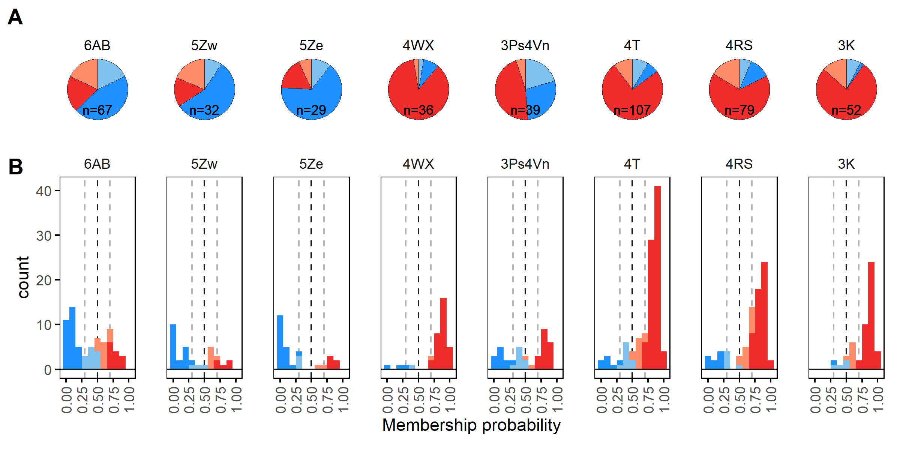

# Quantifying genetic differentiation and population assignment among two contingents of Atlantic mackerel (Scomber scombrus) in the Northwest Atlantic

__Main author:__  Audrey Bourret  
__Affiliation:__  Fisheries and Oceans Canada (DFO)   
__Group:__        Laboratory of genomics   
__Location:__     Maurice Lamontagne Institute  
__Affiliated publication:__ Audrey Bourret, Andrew Smith, Elisabeth Van Beveren, Stéphane Plourde, Kiersten Curti, Teunis Jansen, David E. Richardson, Martin Castonguay, Naiara Rodriguez-Ezpeleta, Geneviève J. Parent (accepted). *Quantifying genetic differentiation and population assignment among two contingents of Atlantic mackerel (Scomber scombrus) in the Northwest Atlantic.* CJFAS  
__Contact:__      audrey.bourret@dfo-mpo.gc.ca

- [Objective](#objective)
- [Summary](#summary)
- [Status](#status)
- [Contents](#contents)
- [Methods](#methods)
  + [Sampling](#sampling)
  + [SNP detection](#snp-detection)
  + [Population structure analyses](#population-structure-analyses)
  + [Genetic assignments](#genetic-assignments)
- [Main Results](#main-results)
- [Requirements](#requirements)
- [Caveats](#caveats)
- [Uncertainty](#uncertainty)
- [Acknowledgements](#acknowledgements)
- [References](#references)

## Objective
The main goal/purpose of the project.

## Summary
Description of the project, provide some background and context. What are the inputs and outputs?

## Status
"Ongoing-improvements"

## Contents
Describe the contents of the repository. Are there multiple scripts or directories? What are there purpose and how do they relate to each other?
### Subsections within contents
Use subsections to describe the purpose of each script if warranted.

## Methods

### Sampling
Adults from NWA and NEA

|  |
|:--:| 
| **Figure 1** Sampling locations in NAFO areas |

### SNP detection

### Population structure analyses

### Genetic assignments

## Main Results

Both the PCA and Fst results showed a division between NWA and NEA samples, and within NWA, a genetic differenciation between northern and southern contingent.

|  |
|:--:| 
| **Figure 2** PCA |

|  |
|:--:| 
| **Figure 3** Fst between NAFO areas 1) between countries, 2) within Canada and 3) within U.S. |

With the best performing method (SVM algorithm, all SNPs), the assignment accuracy was >85% for both contingents. The proportion of mixing of northern and southern contingents varied across NAFO divisions.

|  |
|:--:| 
| **Figure 4** Assigment methods comparison using northern and southern contingent reference individuals; Validating the assignment method using simulated genotypes |

|  |
|:--:| 
| **Figure 5** Pie chart % pop and distribution of membership probabilities within NAFO divisions |

## Requirements
*Optional section.* List the input data requirements or software requirements to successfully execute the code.

## Caveats
Anything other users should be aware of including gaps in the input or output data and warnings about appropriate use.

## Uncertainty
*Optional section.* Is there some uncertainty associated with the output? Assumptions that were made?

## Acknowledgements
*Optional section.* List any contributors and acknowledge relevant people or institutions

## References
*Optional section.*

