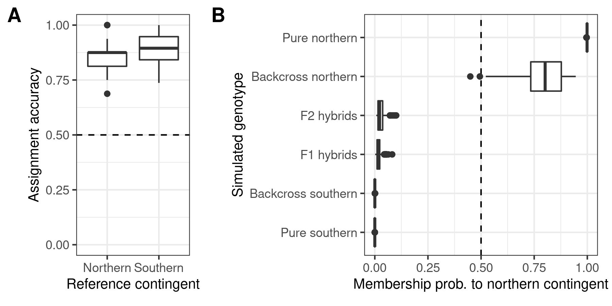

# Scripts and data for the mackerel manuscript: 
## Quantifying genetic differentiation and population assignment among two contingents of Atlantic mackerel (*Scomber scombrus*) in the Northwest Atlantic

__Main author:__  Audrey Bourret  
__Affiliation:__  Fisheries and Oceans Canada (DFO)   
__Group:__        Laboratory of genomics   
__Location:__     Maurice Lamontagne Institute  
__Affiliated publication:__ Bourret A, Smith A, Van Beveren E, Plourde S, Curti K, Jansen T, Richardson DE, Castonguay M, Rodriguez-Ezpeleta N, Parent GJ (accepted). Quantifying genetic differentiation and population assignment among two contingents of Atlantic mackerel (*Scomber scombrus*) in the Northwest Atlantic. Canadian Journal of Fisheries and Aquatic Sciences.  
__Contact:__      audrey.bourret@dfo-mpo.gc.ca

- [Objective](#objective)
- [Status](#status)
- [Contents](#contents)
- [Manuscript main figures](#manuscript-main-figures)
- [Acknowledgements](#acknowledgements)

## Objective
The main objective of this project was to assess genomic differences between Atlantic mackerel of northern and southern contingents in the NWA using genome-wide markers (>10,000 SNPs), and possibly infer the proportions of each contingent in NWA management units. 

## Status
Completed

## Contents
### Folder structure

    .
    ├── OO_Data     # Folder containing data used for the analyses 
    ├── 01_Code     # R scripts  
    ├── 02_Results  # Main results      
    └── README.md

### Main scripts

[**PopGenAnalysis.R**](01_Code/PopGenAnalysis.R) To perform main manuscript analyses

[**Impact_NA_assignments.R**](01_Code/Impact_NA_assignments.R) To test the impact of missing values on assignments

[**Impact_NS_assignments.R**](01_Code/Impact_NS_assignments.R) To test the impact of different sequencers on assignments

[**Panels_metadata.R**](01_Code/Panels_metadata.R) To convert the two SNP panels into various format

## Manuscript main figures

|  |
|:--:| 
| **Figure 1** Sampling location and month of reference (star) and non-reference samples (circle) in NAFO divisions of the Northwest Atlantic.|

|  |
|:--:| 
| **Figure 2** Principal component analyses (PCA) for A) all samples (North East Atlantic, NEA; North West Atlantic, NWA), B) all NWA samples and C) NWA contingent-specific subset of reference samples only. |

|  |
|:--:| 
| **Figure 3** Fst between NAFO areas 1) between countries, 2) within Canada and 3) within U.S. |

|  |
|:--:| 
| **Figure 4** Genetic assignment validation using A) cross-validation using northern and southern contingent reference samples and the best predictive model (support vector machine, SVM) and B) membership probability to the northern contingent of simulated genotypes (“pure” northern and southern contingent, backcrossed with northern or southern contingent, F1 and F2 hybrids).  |

|  |
|:--:| 
| **Figure 5** Genetic assignment results for all non-reference samples to northern (red) and southern (blue) contingents, with indication of membership probability to contingents (light colors: >50%; dark colors: >70%) .  |

## Acknowledgements
We are deeply grateful to Linda Girard and Mélanie Boudreau who phenotyped each individual and prepared samples for genetic analyses, and to Grégoire Cortial, Laury-Ann Dumoulin, Jade Larivière, and Éric Parent from the MLI Laboratory of genomics who extracted and prepared DNA for sequencing. 
